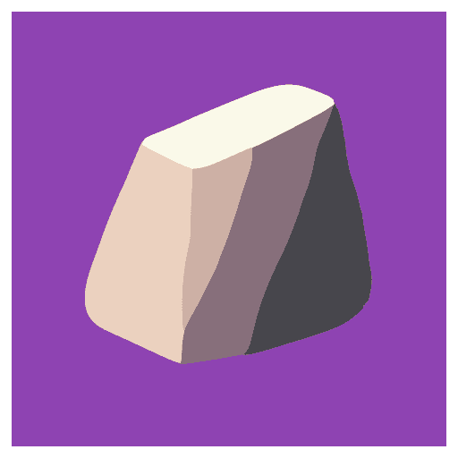

<p align="center">
  
</p>

# grnyte

Privacy-first boulder area management platform with multi-tenant architecture.

[Website](https://grnyte.rocks) | [Demo](https://demo.grnyte.rocks)

## Architecture

**grnyte** is built for boulder area developers who need to balance collaboration with access protection. Using Supabase's Row Level Security (RLS), the platform provides complete data isolation between regions while enabling seamless collaboration within trusted communities.

Perfect for managing sensitive bouldering areas on private land where public exposure could compromise access agreements.

## Key Technical Features

- 🔒 **Multi-tenant architecture with RLS** - Complete data isolation between regions, invitation-only access control
- 🏔️ **Professional area management** - Organize areas, sectors, and problems with detailed topos and grading systems (FB/V grades)
- 📊 **Structured data vs spreadsheets** - Replace scattered Excel files with proper database schema and real-time collaboration
- 📈 **Session tracking and analytics** - Log ascents, track progress, and visualize development over time
- 📸 **Media integration** - Link photos and videos from self-hosted file storage (Nextcloud support)
- 🔐 **Privacy-first design** - Keep sensitive area data private within your community until ready for public platforms
- 📤 **Data portability** - Export capabilities for eventual migration to public platforms when appropriate
- 🚀 **Self-hostable** - Full control over your data with Docker deployment and self-hosted Supabase instance

## Use Cases

- **Private land development**: Manage areas with sensitive access without public exposure
- **Local community collaboration**: Replace email chains and version conflicts with real-time updates
- **Data migration**: Import existing problem lists from Excel/CSV files
- **Professional documentation**: Maintain detailed records with proper backup and version control
- **Access protection**: Keep coordinates and beta private until landowner relationships are secured

## Installation

1. Ensure you have a Supabase instance running, either in the cloud or locally.
2. Copy [`.env.example`](./.env.example) to `.env` and fill in the necessary information about your Supabase instance and Nextcloud.

   ```bash
   npm run generate
   npm run migrate
   ```

## Integration

When areas are established and access is secured, data can be exported to public platforms:

- 8a.nu
- 27crags
- The Crag

## License

This project is licensed under the MIT License - see the [LICENSE](LICENSE) file for details.
