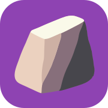
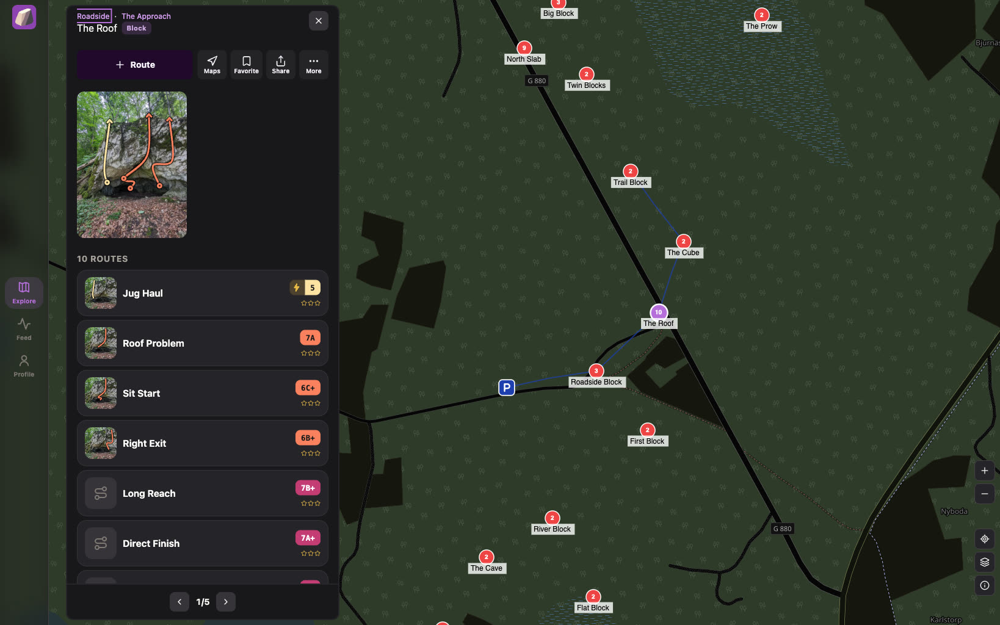
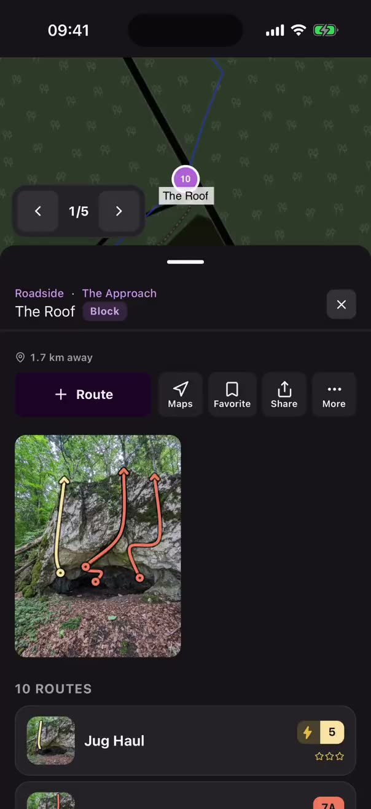
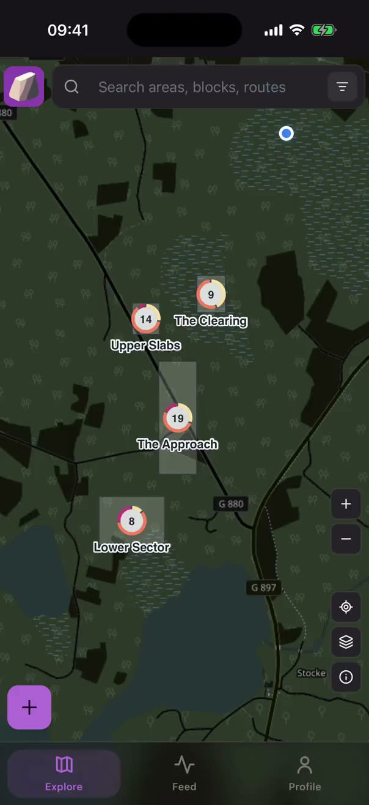
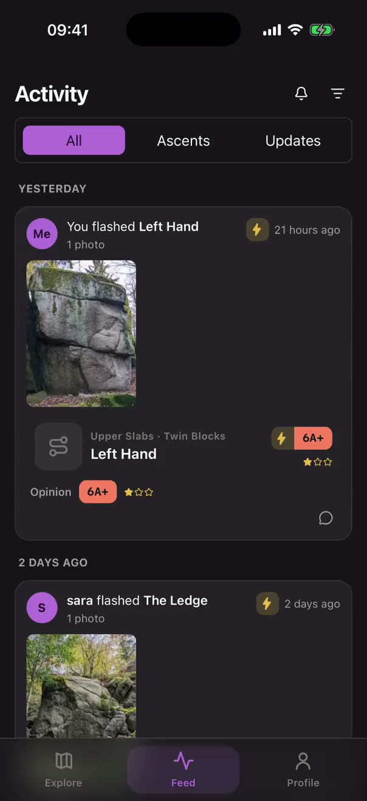

<p align="center">
  
</p>

<h1 align="center">grnyte</h1>

<p align="center">
  <em>Private topos for private crags</em>
</p>

<p align="center">
  A private guidebook and logbook for bouldering.<br />
  Your region is visible only to the people you invite. Anyone can sign up and start a region.
</p>

<p align="center">
  <a href="https://grnyte.rocks">Website</a> &middot;
  <a href="https://grnyte.rocks/help/faq">FAQ</a>
</p>

<p align="center">
  
</p>

## What it is

A region is a group of people and the boulders they document together. You sign up, you start a region, and you invite the people you want in it. Everything in the region stays invisible to everybody else. There is no public region and no public map.

A region holds areas, sectors, blocks and routes. It also holds the topos, the map, and the ascents that each member logs. A topo is a line drawn over a photo of the boulder to show where a route goes.

The database enforces the region boundary. An account that is not a member of a region cannot read the rows of that region, whatever the interface does.

## Screenshots

<table>
  <tr>
    <td width="33%"></td>
    <td width="33%"></td>
    <td width="33%"></td>
  </tr>
  <tr>
    <td align="center">Topo</td>
    <td align="center">Map</td>
    <td align="center">Logbook</td>
  </tr>
</table>

The [website](https://grnyte.rocks) plays a short clip of each one.

## Features

The parts that a screenshot does not show:

1. The app works with no signal. It keeps a copy of your regions on the device.
2. The app installs on a phone or a desktop, and it opens from the home screen.
3. The app sends a push notification when somebody edits the guidebook or logs an ascent.

## Architecture

The stack:

1. SvelteKit and Svelte 5.
2. Postgres, with Drizzle ORM for the schema and the migrations.
3. Supabase for authentication and file storage.
4. Zero by Rocicorp for the sync between the server and the browser.
5. Skeleton and Tailwind CSS for the interface, OpenLayers for the map.
6. Nextcloud for images and Bunny Stream for video.
7. Resend for email, and the Web Push API for notifications.

Two of these decide the shape of the rest.

### Zero

The app does not call an API when you open a page. Zero copies the rows that your account can read into a database in the browser, and it holds that copy in sync over a WebSocket. A query reads the local copy. A page therefore opens at once, and it opens with no network as well. People use grnyte at the crag, where a phone often has no signal.

Writes do not go through Zero. Every change is a SvelteKit remote function that runs on the server.

### Row Level Security

The region boundary is a set of Postgres policies, not a filter in the application code. Every query runs as the account that made the request. The database returns no row from a region that the account is not a member of. A mistake in a component, a missing test in a route, or a hand-written query cannot widen what a person reads.

## Running it locally

You need Node.js 24, npm, and a Supabase project. A local Supabase stack and a cloud project both work.

1. Install the dependencies:

   ```bash
   npm install
   ```

2. Copy [`.env.example`](./.env.example) to `.env` and fill in the values. The file lists every variable that the app reads.

3. Generate the Drizzle schema, the Zero schema and the email templates:

   ```bash
   npm run generate
   ```

4. Apply the migrations to the database:

   ```bash
   npm run migrate
   ```

5. Start the app on port 3000:

   ```bash
   npm run dev
   ```

6. Start the Zero cache in a second terminal:

   ```bash
   npm run dev:zero
   ```

Postgres, Supabase, Nextcloud and the Zero cache all run on your own hardware. Bunny Stream and Resend are third-party services, and neither one has a self-hosted version.

The [`deployment`](./deployment) directory covers the production setup.

## Contributing

grnyte is a hobby project by [Robert Wettstädt](https://github.com/robert-wettstaedt). Open an issue for a bug or a question. A pull request is welcome, but it is unlikely to be merged.

Report a security problem at [grnyte.rocks/legal/report](https://grnyte.rocks/legal/report). Do not open a public issue for it.

## License

This project is licensed under the MIT License. See the [LICENSE](LICENSE) file for details.
